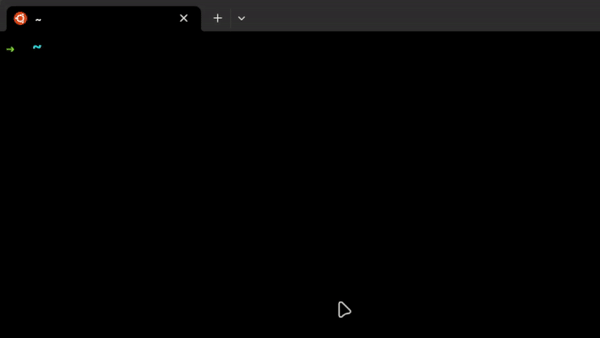

# Bum - Bun Version Manager


<br/>

<a href="https://github.com/owenizedd/bum/actions/workflows/deploy.yml"></a> <br/>

Introducing Bum, a fast Bun version manager written in Rust from scratch.



## How to install:

## Unix

1. Open your terminal and execute:

```
curl -fsSL https://github.com/owenizedd/bum/raw/main/install.sh | bash
```

> This installation will install bun for you and also bum altogether.

## Windows

I only own a Mac, so I can't test at all if Windows is working, and I can't write a script to auto-install on Windows as well. So here are a few instructions on how to install Bum for Windows:

1. Install [Bun](https://bun.sh/)
2. Download the last exe in the [latest release](https://github.com/owenizedd/bum/releases/latest), and unzip it
3. Put the exe in your favorite directory, add the path to this directory in your PATH, and that's it!

As Bum is not tested at all on Windows, it may not works. If it's the case please open an issue and I'll be glad to fix it.

## How to use:

- You can just run `bum` without any parameter to see default help menu.

### Commands

- `bum use <version>`
  - Change the current active bun version, e.g. `bum use 1.0.3`. This will automatically use v1.0.3.
  - If there's no target version is installed in the local, it will install that version then use it.
  - Else, it will just use that version directly as the active version.
- `bum remove <version>`
  - Remove the installed version locally.
    > This feature will only remove local copy, but if you're using the removed version, you will still be able to use that version, but once you change to other version, you will not be able to change to that version anymore.
  - In the future we will automatically switch to the latest version available upon removal of the version.
- `bum list`
  - Show all local installed versions of Bun.
- `bum list-remote`

  - Show all remote versions of Bun that could be installed.

- .bumrc file
  - When file exists, everytime you use `bum use` command without `<version>` argument, Bum will try to use the version from the .bumrc file.

### Future features (possibly)

- `bum default <version>`

> Any contribution is appreciated, have any doubts/questions/suggestions/ideas? Drop them in the Discussion page.
