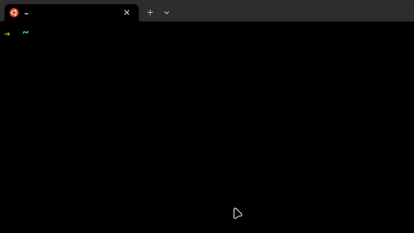

# Bum - Bun Version Manager


<br/>

<a href="https://www.npmjs.com/package/@owenizedd/bum"></a>
<a href="https://www.npmjs.com/package/@owenizedd/bum"></a>
<a href="https://docs.npmjs.com/generating-provenance-statements"></a>
<a href="https://github.com/owenizedd/bum/actions/workflows/deploy.yml"></a>
<a href="https://github.com/owenizedd/bum/releases"></a>
<a href="https://github.com/owenizedd/bum/commits/main"></a>
<a href="https://github.com/owenizedd/bum/stargazers"></a>
<a href="https://github.com/owenizedd/bum/blob/main/CONTRIBUTING.md"></a>
<a href="https://github.com/owenizedd/bum/blob/main/LICENSE"></a>
<a href="https://www.rust-lang.org/"></a>
<br/>
Introducing Bum, a fast Bun version manager written in Rust from scratch.



## How to install:

### Via npm/npx (Easier)

The easiest way to use Bum is via npm.

> **Note:** When installing via npm, `~/.bun/bin` is not automatically added to your PATH. Add this line to your shell config (`~/.bashrc`, `~/.zshrc`, etc.) **before** installing so you can run `bun` directly after activation: `export PATH="$HOME/.bun/bin:$PATH"`

```bash
# Use without installation
npx @owenizedd/bum use 1.0.3

# Or install globally
npm install -g @owenizedd/bum
bum use 1.0.3
```

### Via Script (Faster performance)

If npm/npx doesn't work or you prefer native CLI experience, you can fallback to Rust binary:

1. Open your terminal and execute:

```
curl -fsSL https://github.com/owenizedd/bum/raw/main/install.sh | bash
```

> This installation will install bun for you and also bum altogether.

## How to use:

- You can just run `bum` without any parameter to see default help menu.

### Commands

- `bum use <version>`
  - Change the current active bun version, e.g. `bum use 1.0.3`. This will automatically use v1.0.3.
  - If there's no target version is installed in the local, it will install that version then use it.
  - Else, it will just use that version directly as the active version.
- `bum remove <version>`
  - Remove the installed version locally.
    > This feature will only remove local copy, but if you're using the removed version, you will still be able to use that version, but once you change to other version, you will not be able to change to that version anymore.
  - In the future we will automatically switch to the latest version available upon removal of the version.
- `bum list`
  - Show all local installed versions of Bun.
- `bum list-remote`

  - Show all remote versions of Bun that could be installed.

- .bumrc file
  - When file exists, everytime you use `bum use` command without `<version>` argument, Bum will try to use the version from the .bumrc file.

### Future features (possibly)

- `bum default <version>`

## Contributing

We welcome contributions! Please see our [Contributing Guide](./technical-docs/CONTRIBUTING.md) for details on:
- Development setup
- Running tests
- Code style guidelines
- Pull request process

For maintainers releasing new versions, see the [Release Guide](./technical-docs/RELEASE.md).

## Questions or Issues?

- 💬 Have questions? Open a [Discussion](https://github.com/owenizedd/bum/discussions)
- 🐛 Found a bug? Open an [Issue](https://github.com/owenizedd/bum/issues)
- 💡 Have ideas? We'd love to hear them!

## License

MIT
